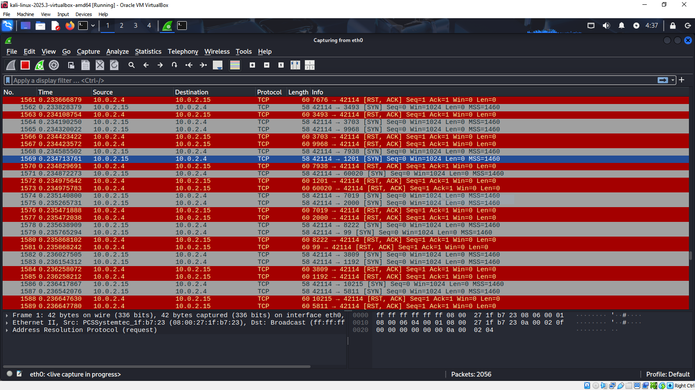
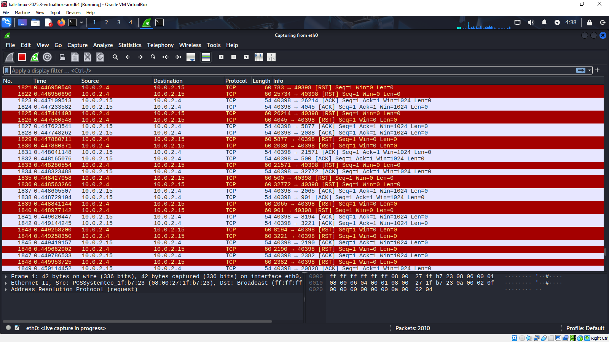
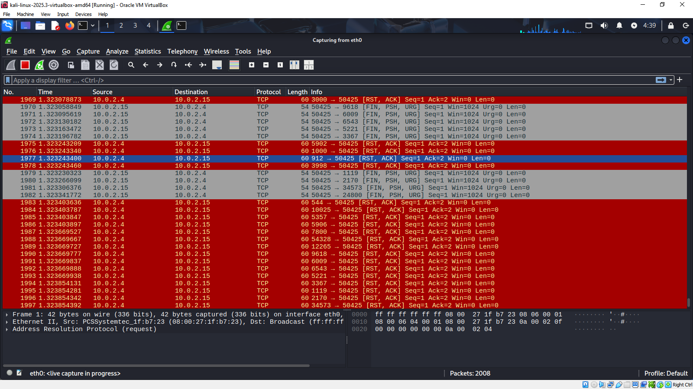
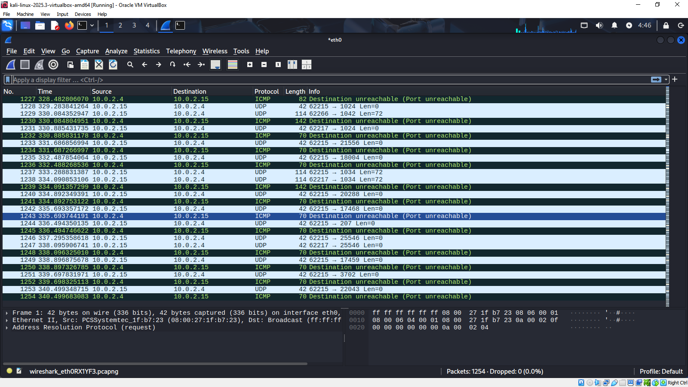

# Домашнее задание к занятию «Уязвимости и атаки на информационные системы - Евгений Борзов»

### Задание 1

Просканируйте эту виртуальную машину, используя **nmap**.
Ответьте на следующие вопросы:
- Какие сетевые службы в ней разрешены?

**FTP, SSH, SMTP, HTTP, telnet, apache, Samba, MYSQL, PostgreSQl, VNC, IRC и несколько других**

- Какие уязвимости были вами обнаружены? (список со ссылками: достаточно трёх уязвимостей)
  
[vsftpd 2.3.4 - Backdoor Command Execution](https://www.exploit-db.com/exploits/49757)

[PostgreSQL 8.3.6 - Conversion Encoding Remote Denial of Service](https://www.exploit-db.com/exploits/32849)

[ProFTPD 1.3.7a - Remote Denial of Service ](https://www.exploit-db.com/exploits/49697)

---

### Задание 2

Проведите сканирование Metasploitable в режимах SYN, FIN, Xmas, UDP.
Запишите сеансы сканирования в Wireshark.
Ответьте на следующие вопросы:
- Чем отличаются эти режимы сканирования с точки зрения сетевого трафика?
- Как отвечает сервер?

**SYN: отправляется TCP-пакет с SYN флагом, если получен ответ SYN/ACK, значит порт открыт**

**FIN: отправляется TCP-пакет с флагом FIN, открытые порты не отвечают, закрытые отправляют RST**

**Xmas: отправляется TCP-пакет с флагами FIN, PSH и URG, открытые порты не отвечают, закрытые отправляют RST**

**UDP: отправляет UDP-пакет, открытые порты, как правило, не отвечают, закрытые отправляют ошибку**

